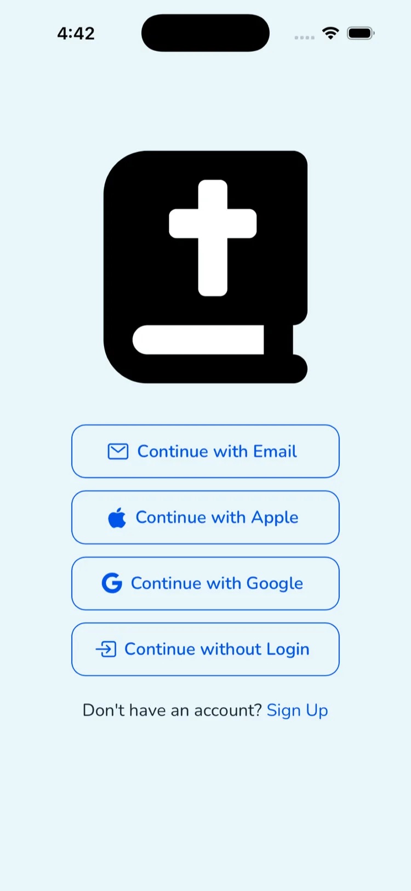

## Hey Bible ✝️

Hey Bible is an easy to use Bible verse lookup tool. With Hey Bible, you can quickly search and favorite verses take notes, and generate beautiful images of your favorite verses.

It's also the **one-stop gateway for giving AI agents access to the Bible** — through an agent skill, an MCP server, a CLI, a typed SDK, and a REST API.

### Web

You can use Hey Bible on the web at [heybible.app](https://heybible.app).

### Mobile

Hey Bible is available on the [App Store](https://apps.apple.com/us/app/hey-bible/id6474075530) and [Google Play](https://play.google.com/store/apps/details?id=com.workingdevshero.heybible).

        

 

### For Developers & AI Agents

Hey Bible is the one-stop gateway for giving AI agents access to the Bible. Pick the door that fits your stack — they all share one API and one key:

| | Package | Use it for |
|---|---|---|
| 🤖 **Agent Skill** | [`hey-bible` on ClawHub](https://clawhub.ai/hey-bible/skills/hey-bible) | OpenClaw-compatible agents |
| 🔌 **MCP Server** | [`@hey-bible/mcp`](https://www.npmjs.com/package/@hey-bible/mcp) | Claude Desktop & MCP clients |
| ⌨️ **CLI** | [`@hey-bible/cli`](https://www.npmjs.com/package/@hey-bible/cli) | Terminals, scripts, automation |
| 📦 **SDK** | [`@hey-bible/client`](https://www.npmjs.com/package/@hey-bible/client) | Custom TypeScript integrations |
| 🌐 **REST API** | [api.heybible.app](https://docs.heybible.app) | Anything else (50+ languages) |

Read the [developer docs](https://docs.heybible.app) to get started.

### Support

If you have any questions or feedback, please fill out [this form](https://app.youform.com/forms/o1pfzrgp) and we'll get back to you as soon as possible.
